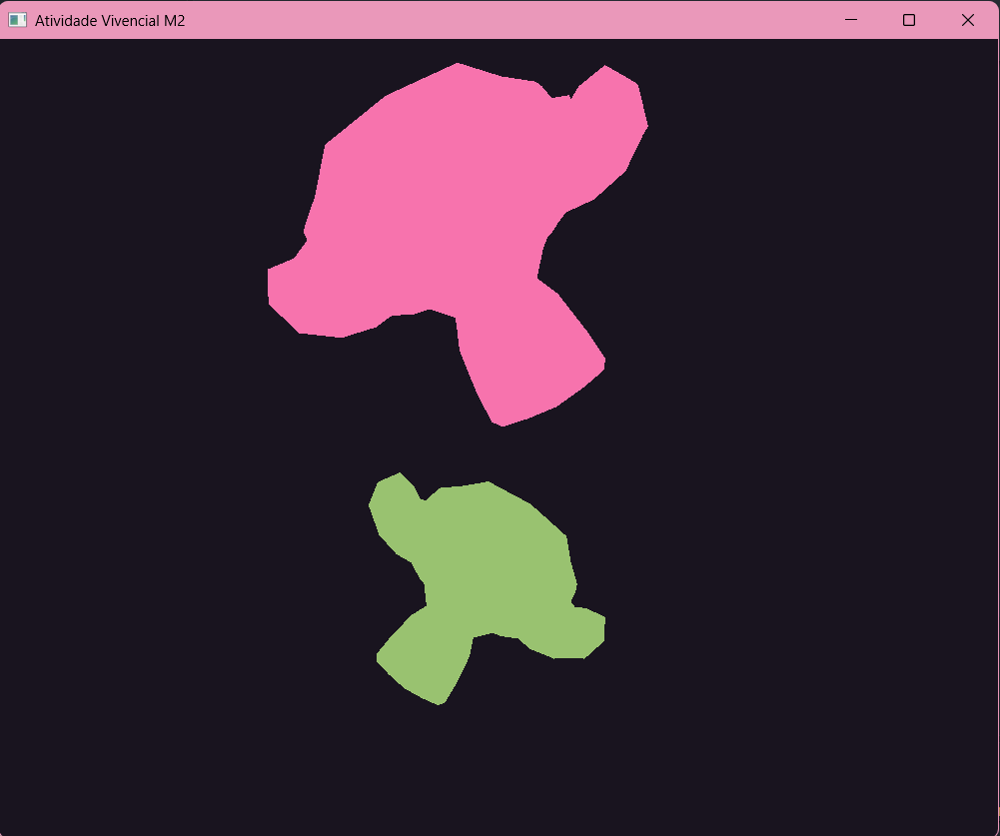

# Vivencial 2 - Seleção e transformações em objetos 3D

Trabalho da disciplina de Computação Gráfica (Unisinos).

O programa carrega modelos 3D a partir de arquivos `.OBJ` (só a geometria, sem
textura e sem iluminação por enquanto), mostra dois objetos na tela e permite
selecionar um deles pelo teclado para aplicar rotação, translação e escala.



## O que foi implementado

- Leitura de arquivos `.OBJ`, recuperando os vértices (`v`) e as faces (`f`)
- Dois objetos na cena, guardados num `vector<Object3D>`
- Seleção do objeto ativo com TAB (o selecionado fica verde)
- Rotação, translação e escala nos eixos X, Y e Z
- Escala uniforme opcional
- Reset da cena para o estado inicial

Cada objeto tem sua própria matriz de modelo, montada na ordem
escala → rotação → translação. Os dois compartilham o mesmo VAO, porque a
geometria é a mesma, o que muda entre eles é só a matriz.

## Como compilar e rodar

Precisa ter CMake e um compilador C++ instalados. No Windows usei o MSYS2 com
o VS Code.

```bash
git clone <link-do-repositorio>
cd <pasta-do-projeto>
cmake -S . -B build
cmake --build build
```

O CMake baixa a GLFW e a GLM sozinho, então não precisa instalar nada além disso.

Para rodar, entre na pasta `build` (importante, senão o programa não acha os
modelos):

```bash
cd build
./Vivencial_M2
```

Os modelos ficam em `assets/Modelos3D/`. Para trocar o modelo exibido, é só
mudar o caminho na chamada do `loadSimpleOBJ`, dentro da `main`.

## Controles

| Tecla         | O que faz                                  |
| ------------- | ------------------------------------------ |
| TAB           | troca o objeto selecionado                 |
| R             | entra no modo rotação                      |
| T             | entra no modo translação                   |
| S             | entra no modo escala                       |
| X / Y / Z     | aplica a transformação no eixo escolhido   |
| Shift + X/Y/Z | aplica no sentido contrário                |
| U             | liga/desliga a escala uniforme             |
| Setas         | translada nos eixos X e Y                  |
| Espaço        | volta a cena para o estado inicial         |
| P             | alterna entre malha preenchida e wireframe |
| ESC           | fecha o programa                           |

O modo começa em translação. O modo escolhido e o objeto selecionado aparecem
no console.

## Estrutura

```
src/Vivencial_M2.cpp   código do trabalho
assets/Modelos3D/      modelos .obj
include/glad/          GLAD
common/glad.c
CMakelists.txt
```

## Referências

- Código base do leitor de OBJ: repositório da disciplina (`Code snippets`)
- [GLFW Input Guide](https://www.glfw.org/docs/latest/input_guide.html)
- Documentação da GLM para as matrizes de transformação

---

Autora: Eduarda Fernandes e Maria Eduarda Dias
